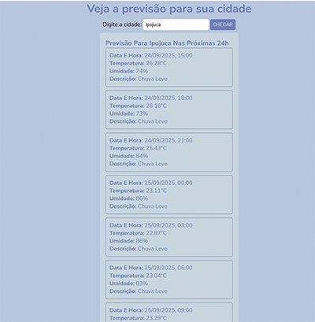

# 🌦️ Previsão do Tempo  


Aplicação simples que consome a API da [OpenWeatherMap](https://openweathermap.org) para exibir a previsão do tempo em tempo real.  

## 🚀 Tecnologias
- HTML, CSS, JavaScript  
- Node.js + NPM  
- OpenWeatherMap API  

## 📦 Instalação
```bash
git clone https://github.com/Flaviabenegas/previsao-do-tempo.git
cd previsao-do-tempo
npm install
```
Crie um arquivo .env com sua chave da API:

>API_KEY=sua_chave_aqui

▶️ Executar
```
npm run dev
```

Abra index.html com a extensão Live Server no VS Code.

📸 Preview

